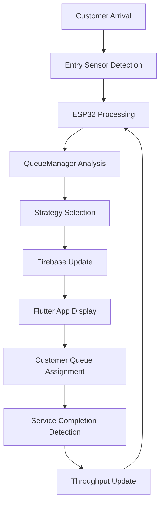

# Smart Queue Management System  
_IoT Project - Intelligent Queue Distribution System_

## Project Overview
This project implements an **IoT-based smart queue management system** that intelligently distributes customers across multiple service lines using real-time data analysis and machine learning algorithms.

**🌐 Live Demo**: [https://iot-queue-management.web.app](https://iot-queue-management.web.app)

The system features multiple queue selection strategies:
- **Shortest Wait Time**: Considers both queue length and service throughput
- **Fewest People**: Simple queue length-based distribution  
- **Distance-based**: Farthest/nearest from entrance distribution

## Key Features
- **Real-time Queue Analytics**: Live tracking of queue lengths and service rates
- **Multiple Selection Algorithms**: Configurable strategies for optimal customer distribution
- **Firebase Integration**: Cloud-based real-time database for cross-platform synchronization
- **Cross-platform Support**: ESP32 firmware, Flutter mobile app, and C++ simulations
- **Throughput Tracking**: Historical service rate analysis for improved predictions
- **Fallback Mechanisms**: Continues operation during network/sensor failures

## Architecture

### Hardware Components
- **ESP32 DevKit V1**: Main microcontroller
- **Entry/Exit Sensors**: Customer detection and tracking
- **Display Interface**: Real-time queue recommendations
- **Firebase Connectivity**: Cloud data synchronization

### Software Stack
- **ESP32 Firmware**: C++ implementation with Arduino framework
- **Flutter Mobile App**: Cross-platform customer interface
- **Firebase Realtime Database**: Cloud data storage and synchronization
- **C++ Simulation Environment**: Testing and algorithm validation

## Project Structure

### Core Directories
- **`ESP32/`**: ESP32 firmware and hardware integration code
- **`flutter_app/`**: Flutter mobile application for customer interface  
- **`shared/`**: Core C++ queue management library and algorithms
- **`simulations/`**: C++ simulation tools for testing different strategies
- **`Documentation/`**: Technical documentation and integration guides

### Key Components
- **`shared/cpp/QueueManager.h/cpp`**: Core queue management logic
- **`shared/cpp/FirebaseClient.h/cpp`**: Firebase integration layer
- **`shared/cpp/ThroughputTracker.h/cpp`**: Service rate analysis
- **`shared/cpp/Person.h/cpp`**: Customer data structure
- **`firebase_options.dart`**: Firebase configuration for Flutter
- **`CMakeLists.txt`**: Build configuration for C++ components

## Technologies Used

### Backend/Firmware
- **C++17**: Core algorithms and ESP32 firmware
- **Arduino Framework**: ESP32 development
- **CMake**: Build system for simulations
- **Firebase REST API**: Cloud database integration

### Frontend
- **Flutter 3.9.2+**: Cross-platform UI development
- **Dart**: Programming language for Flutter
- **Firebase SDK**: Real-time database connectivity

### Cloud Services
- **Firebase Realtime Database**: Real-time data synchronization
- **Firebase Analytics**: Usage tracking and insights

## Building and Running

### Prerequisites
- CMake 3.16+
- Flutter SDK 3.9.2+
- Arduino IDE (for ESP32)
- Firebase project setup

### C++ Simulations
```bash
cd shared
mkdir build && cd build
cmake ..
make
```

### Flutter App
```bash
cd flutter_app
flutter pub get
flutter run
```

### ESP32 Deployment
1. Configure WiFi credentials in `ESP32/SECRETS.h`
2. Upload firmware using Arduino IDE
3. Connect sensors according to connection diagram

### Generating Performance Graphs
After running simulations, generate visualization graphs:

```bash
# Run the unified queue simulator to generate data
cd shared/bin
./unified_queue_simulator

# Generate graphs from simulation data
cd ../simulation_output
python3 graph_script.py
```

The graphs will be saved in `shared/simulation_output/plots/` directory and include:
- Queue length comparison across strategies
- Average wait time analysis
- Throughput performance metrics
- Strategy switching behavior over time

## Queue Selection Strategies

### Available Algorithms
1. **`SHORTEST_WAIT_TIME`**: Intelligent distribution considering queue length and service throughput
2. **`FEWEST_PEOPLE`**: Simple queue length-based assignment
3. **`FARTHEST_FROM_ENTRANCE`**: Distributes to lines farther from entrance
4. **`NEAREST_TO_ENTRANCE`**: Distributes to lines closer to entrance

### Simulation Tools
- **`QueueSimulatorProject.cpp`**: Main project simulation with configurable parameters
- **`QueueSimulatorShortest.cpp`**: Shortest wait time strategy testing
- **`QueueSimulatorFarthest.cpp`**: Distance-based strategy testing  
- **`UnifiedQueueSimulator.cpp`**: Comprehensive multi-strategy comparison

## Firebase Integration
The system uses Firebase Realtime Database for:
- **Real-time queue state synchronization**
- **Cross-platform data sharing** (ESP32 ↔ Flutter)
- **Historical throughput data storage**
- **Offline capability with local caching**

Detailed integration guide available in `Documentation/firebase_integration_guide.md`

## Development Setup

### Environment Requirements
- **CMake**: 3.16 or higher
- **C++ Compiler**: Supporting C++17 standard
- **Flutter SDK**: 3.9.2 or higher  
- **Arduino IDE**: For ESP32 development
- **Firebase Account**: For cloud services

### Flutter Dependencies
```yaml
firebase_core: ^3.6.0
firebase_database: ^11.1.4
firebase_analytics: ^11.3.3
firebase_auth: ^5.3.1
connectivity_plus: ^6.0.5
flutter_svg: ^2.0.10+1
```

## Usage Examples

### Live Web Application
Visit the deployed application at: **[https://iot-queue-management.web.app](https://iot-queue-management.web.app)**

The web app provides real-time queue visualization, wait time estimates, and queue recommendations synchronized with the ESP32 hardware and simulations.

### ESP32 Integration
```cpp
#include "QueueManager.h"

// Initialize with 2 lines, ESP32 configuration
QueueManager queueManager(50, 2, "_ESP32", "iot-queue-management");

// Customer arrival detection
if (queueManager.enqueueAuto()) {
    // Customer successfully assigned to optimal queue
}

// Customer service completion
if (queueManager.dequeue(lineNumber)) {
    // Customer served, update statistics
}
```

### Flutter App Interface
The Flutter app provides:
- **Real-time queue visualization**
- **Wait time estimates**
- **Queue recommendations**
- **Historical analytics**

## Performance Metrics
The system tracks and optimizes:
- **Average wait times** per queue line
- **Service throughput** rates
- **Customer distribution efficiency**
- **System uptime and reliability**

## Documentation
- **`Documentation/firebase_integration_guide.md`**: Comprehensive Firebase setup guide
- **`Documentation/connection diagram/`**: Hardware wiring diagrams
- **Source code documentation**: Inline comments and headers

## Contributing
This project uses modern C++ practices and Flutter best practices. Please refer to the inline documentation and follow the established code structure when contributing.

## System Architecture Diagram

